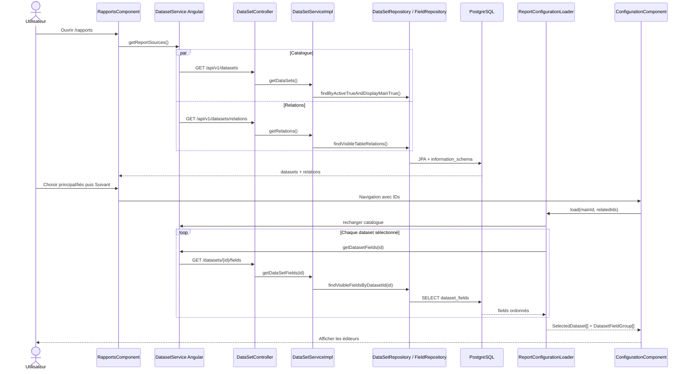

# 01 — Sélection des datasets et chargement de la configuration

## Déclencheur utilisateur

L'utilisateur ouvre `/rapports`. Le constructeur de `RapportsComponent` lance immédiatement le chargement du catalogue. Il ouvre ensuite un dataset principal, coche éventuellement des datasets liés, puis clique sur « Suivant ».

## Chaîne complète

```text
Route /rapports
  → RapportsComponent.constructor()
  → loadReportSources()
  → DatasetService.getReportSources()
  → forkJoin(GET /datasets, GET /datasets/relations)
  → DataSetController
  → DataSetService (interface) / DataSetServiceImpl
  → DataSetRepository
  → tables datasets + information_schema PostgreSQL
  → Dataset[] + TableRelation[]
  → Signals datasets/relations
  → computed datasetAccordions
  → sélection UI du principal et des relations
  → continueToConfiguration()
  → /rapports/configuration/:datasetId?relatedDatasetIds=...
  → ConfigurationComponent.loadConfiguration()
  → ReportConfigurationLoader.load()
  → catalogue à nouveau, puis GET /datasets/{id}/fields par dataset
  → DataSetFieldRepository → dataset_fields
  → DatasetField[] → ReportField[] → DatasetFieldGroup[]
  → Signals selectedDatasets/fieldGroups
  → affichage des éditeurs
```

## Participants du flow

| Participant | Type / responsabilité principale | Rôle réel |
| --- | --- | --- |
| [`RapportsComponent`](../../../Frontend/Rhis_report_gen/src/app/features/rapports/pages/source_de_donnes/rapports.component.ts) | Angular Component — UI/orchestration | Charge le catalogue, construit les accordéons, conserve les sélections et navigue. |
| [`ReportRelatedCardComponent`](../../../Frontend/Rhis_report_gen/src/app/features/rapports/components/report-related-card/report-related-card.component.ts) | Angular Component — UI | Émet `selectedChange`; il ne connaît ni route ni HTTP. |
| [`DatasetService`](../../../Frontend/Rhis_report_gen/src/app/features/rapports/services/dataset.service.ts) | Angular Service — transport | Effectue les trois types de `GET` avec cookies et agrège catalogue + relations par `forkJoin`. |
| `Dataset`, `TableRelation`, `DatasetField` | Interfaces TypeScript — transport | Reproduisent les réponses backend utiles à l'UI. |
| [`ConfigurationComponent`](../../../Frontend/Rhis_report_gen/src/app/features/rapports/pages/configuration/configuration.component.ts) | Angular Component — orchestration | Parse la route, demande le chargement et installe les Signals de configuration. |
| [`ReportConfigurationLoader`](../../../Frontend/Rhis_report_gen/src/app/features/rapports/pages/configuration/report-configuration-loader.service.ts) | Angular Service — résolution/transformation | Valide la sélection de route et charge les fields dans l'ordre des datasets retenus. |
| [`DataSetController`](../../src/main/java/RHIS/com/RHIS/dataset/controller/DataSetController.java) | REST Controller — HTTP | Expose le catalogue, les relations et les fields. |
| [`DataSetService`](../../src/main/java/RHIS/com/RHIS/dataset/service/DataSetService.java) | Interface Spring — abstraction structurelle | Contrat réellement injecté dans le controller; une seule implémentation existe. |
| [`DataSetServiceImpl`](../../src/main/java/RHIS/com/RHIS/dataset/service/DataSetServiceImpl.java) | Spring Service — orchestration/lecture | Appelle les repositories et mappe les entities/projections vers les DTO. |
| [`DataSetMapper`](../../src/main/java/RHIS/com/RHIS/dataset/controller/DataSetMapper.java) | Component — transformation | Convertit `DataSetEntity`/`DataSetField` en réponses publiques. |
| `DataSetResponse`, `DataSetFieldResponse`, `TableRelationResponse` | Records DTO — transport | Évitent d'exposer directement les entities JPA. |
| [`DataSetRepository`](../../src/main/java/RHIS/com/RHIS/dataset/repository/DataSetRepository.java) | Spring Data Repository — persistance/SQL | Lit les datasets et exécute la requête native de relations. |
| [`TableRelationProjection`](../../src/main/java/RHIS/com/RHIS/dataset/controller/dto/TableRelationProjection.java) | Projection interface — mapping SQL | Spring projette les alias de la requête native dans ses getters; elle n'a aucune implémentation écrite. |
| [`DataSetFieldRepository`](../../src/main/java/RHIS/com/RHIS/dataset/repository/DataSetFieldRepository.java) | Spring Data Repository — persistance | Charge les fields visibles par JPQL et par position. |
| `DataSetEntity`, `DataSetField` | Entities JPA — catalogue | Représentent `datasets` et `dataset_fields`. |

`JoinInfoProjection` n'est pas participant : il n'est référencé par aucun appel de production.

## Étapes détaillées

### 1. Chargement initial parallèle

`RapportsComponent.loadReportSources()` positionne `isLoading`, efface l'erreur puis souscrit à :

```typescript
forkJoin({
  datasets: this.getDatasets(),
  relations: this.getRelations(),
})
```

`forkJoin` n'émet qu'après succès des deux requêtes. Une erreur sur l'une annule le résultat global : le composant vide les deux Signals et affiche un bouton « Réessayer ». `takeUntilDestroyed` libère la souscription et `finalize` réinitialise le chargement.

### 2. Lecture des datasets

`GET /api/v1/datasets` appelle `DataSetServiceImpl.getDataSets()`, puis `findByActiveTrueAndDisplayMainTrue()`. Une table n'apparaît comme source initiale que si elle est active et autorisée comme principale. L'`@EntityGraph(attributePaths = "dataSetFieldSet")` charge aussi la collection de fields alors que le mapper ne l'utilise pas : c'est un coût de lecture réel, pas une étape fonctionnelle du flow.

Chaque entity devient :

```text
DataSetEntity(id, displayName, sourceName, active, displayMain, displayRelated, fields...)
  → DataSetResponse(id, displayName, sourceName)
  → Dataset TypeScript
```

### 3. Découverte des relations

`GET /api/v1/datasets/relations` exécute `findVisibleTableRelations()`. La requête native :

- part de `information_schema.table_constraints` filtré sur les foreign keys du schéma `public` ;
- rejoint `referential_constraints` et deux fois `key_column_usage` ;
- aligne les colonnes d'une clé composite avec `position_in_unique_constraint` ;
- rejoint `datasets` deux fois : source active, cible active et `displayRelated=true`. Le mode relation de la source n'intervient pas ;
- ordonne par table source, nom de contrainte et position de colonne.

Le `DISTINCT` est présent dans la requête. Il élimine d'éventuels doublons identiques de métadonnées; il ne corrige pas une multiplication des lignes métier, car aucune table métier n'est lue ici.

`TableRelationProjection` contient aussi `constraintName` et `position`, mais `TableRelationResponse` les retire. Le frontend peut donc afficher plusieurs mappings d'une clé composite, mais ne sait pas les regrouper explicitement par contrainte.

### 4. Sélection UI et navigation

`buildRelationMappings()` ne conserve que le sens sortant `source → target` et ignore les self-relations. `selectedDatasetId` contient le principal; `selectedRelatedDatasetIds` est un `ReadonlySet` remplacé à chaque changement. Le `computed selectedDatasetSummary` place le principal en premier et trie les liés par libellé français.

`continueToConfiguration()` trie les IDs liés numériquement et navigue vers :

```text
/rapports/configuration/{principal}?relatedDatasetIds=2,7,...
```

Il n'y a encore aucune sauvegarde serveur.

### 5. Résolution de la route et chargement des fields

`ConfigurationComponent` exige des IDs entiers positifs; il déduplique et trie les IDs liés. `ReportConfigurationLoader` recharge le catalogue, vérifie que :

- le principal existe dans les datasets visibles renvoyés ;
- chaque lié est la cible d'une relation directe sortante depuis le principal ;
- aucune relation réflexive n'est acceptée.

Il utilise les métadonnées de relation pour créer les datasets liés, garde le principal en tête, trie les autres par libellé, puis lance un `GET /datasets/{id}/fields` pour chacun via `forkJoin`.

Le backend conserve un unique endpoint `GET /datasets/{id}/fields`. Sa JPQL applique exclusivement `dataset.active=true AND field.active=true AND field.visible=true`, indépendamment de `displayMain` et `displayRelated`, puis ordonne par `field.position`. Le catalogue et le resolver portent les règles contextuelles main/relation. `DataSetFieldResponse` ajoute le type normalisé, `supported` et la liste d'opérateurs autorisés. Le loader retire les fields non supportés et enrichit chaque field d'une clé UI `${dataset.id}:${field.id}`; l'ID backend reste inchangé.

### 6. Administration de l'exposition

La route Angular lazy `/administration/datasets`, protégée par `adminGuard`, charge `GET /api/v1/admin/dataset-exposure`. Le backend exige `ROLE_ADMIN` au niveau URL et méthode. La réponse contient toutes les tables et tous leurs champs, y compris inactifs, mais seulement leurs identifiants, `displayName` et états d'exposition : aucun `sourceName` n'est fourni à cet écran.

L'interface utilise un master-detail : la liste des tables et sa recherche sont indépendantes du détail et de la recherche de champs. Aucune table n'est présélectionnée après le premier chargement. Sur un écran étroit, la sélection ouvre le détail et `Retour aux tables` restaure la liste et le focus sans perdre le brouillon. Les tables et champs inactifs restent visibles mais non modifiables.

L'administrateur choisit l'un des quatre modes dérivés de `displayMain/displayRelated`, modifie la visibilité des champs et envoie un seul `PUT` explicite contenant uniquement le delta global. Il peut parcourir et modifier plusieurs tables avant l'enregistrement ; `Annuler les modifications` restaure localement la dernière configuration chargée sans requête HTTP. Le service backend valide tout le lot avant mutation, flush dans la transaction et retourne la configuration complète. Le mode « Non exposée » désactive les contrôles de champs dans l'UI sans effacer leurs préférences.

Un unique `p-toast` PrimeNG est rendu à la racine de l'application. Le succès et l'échec du `PUT` y utilisent des messages fonctionnels ; un détail technique backend est seulement journalisé. En revanche, l'échec du `GET` initial reste affiché dans la page avec `Réessayer`, car il empêche l'utilisation complète de l'écran. Un `CanDeactivateFn` protège les navigations Angular et `beforeunload` protège le rechargement ou la fermeture tant que le brouillon contient des changements.

## Transformation des données

```text
datasets + information_schema
  → DataSetEntity / TableRelationProjection
  → DataSetResponse[] / TableRelationResponse[]
  → Dataset[] / TableRelation[]
  → route datasetId + relatedDatasetIds
  → SelectedDataset[]
dataset_fields
  → DataSetField
  → DataSetFieldResponse
  → DatasetField
  → ReportField (+ key, datasetId, datasetDisplayName)
  → DatasetFieldGroup[]
  → Signals → templates des éditeurs
```

## Transactions et base de données

- `getRelations()` et `getDataSetFields()` ont une transaction Spring `readOnly = true` couvrant repository + mapping.
- `getDataSets()` n'a pas d'annotation transactionnelle explicite; la méthode Spring Data ouvre sa transaction de lecture. L'entity graph évite ici un lazy loading ultérieur de `dataSetFieldSet`, même si la collection n'est pas consommée.
- Cardinalité des endpoints : une ligne par dataset; une ligne par colonne de foreign key pour les relations; une ligne par field visible pour un dataset.
- Aucun `fetchSize`, pagination ou cache applicatif n'est configuré sur ce catalogue.

## Cas d'erreur

- Erreur de l'un des deux `GET` initiaux : les deux collections UI sont vidées et un message générique est affiché.
- ID de route invalide : aucun HTTP, état réinitialisé, message local.
- Dataset principal absent ou lié non directement accessible : résultat métier du loader, affiché par `ConfigurationComponent`.
- Erreur d'un `GET fields` : propagation RxJS, reset de la configuration et message générique.
- Le backend dataset ne possède pas de `@RestControllerAdvice` dédié. Le `PUT /datasets/{id}` renvoie actuellement `null` et ne constitue pas un flow implémenté.
- Sécurité courante : ces endpoints sont `permitAll`, malgré `withCredentials: true` côté Angular.

## Diagramme de séquence



## En langage métier

1. L'application charge les sources disponibles et leurs liens directs.
2. L'utilisateur choisit une source principale et éventuellement des sources directement liées.
3. La sélection est transportée dans l'URL.
4. La page suivante revérifie la sélection et charge les colonnes utilisables.
5. Seules les colonnes actives, visibles et techniquement supportées sont proposées.

## Points importants à retenir

- Les relations sont orientées : une relation entrante ne rend pas un dataset sélectionnable depuis la racine.
- Une clé composite produit plusieurs lignes de relation côté API.
- `ReportConfigurationLoader`, et non le composant, garantit principal d'abord et liés directs uniquement.
- Le catalogue est rechargé en arrivant sur la configuration; la page ne réutilise pas l'état mémoire de `RapportsComponent`.

## Points potentiellement confus

- `DataSetService` étend un CRUD générique, mais les méthodes CRUD héritées ne participent pas à ce flow.
- `@EntityGraph(dataSetFieldSet)` sur la liste des datasets ressemble à une optimisation mais charge des données non consommées.
- Le frontend reconstruit les datasets liés depuis `TableRelation`, pas depuis `Dataset[]`.
- Le contrat relation ne transporte pas le nom de contrainte; seul le backend conserve cette information dans la projection.
