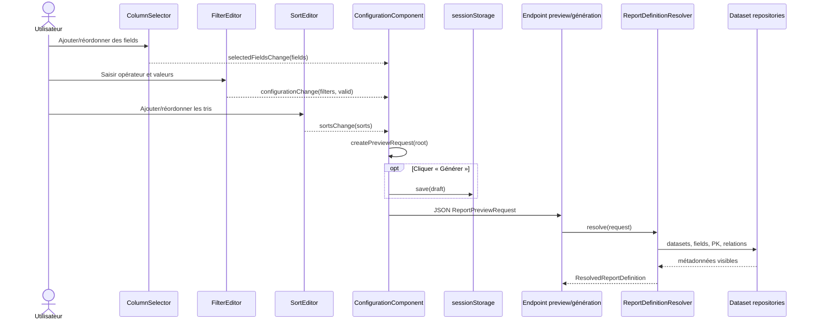

# 02 — Définition du rapport : fields, filters, sorts et brouillon local

## Déclencheurs utilisateur

Sur `/rapports/configuration/:datasetId`, l'utilisateur :

- ajoute, retire ou réordonne des colonnes ;
- ajoute des filtres et saisit leurs valeurs ;
- ajoute et priorise des tris ;
- déclenche ensuite une preview ou une génération.

L'édition elle-même reste locale. Le backend ne reçoit la définition qu'au clic « Aperçu » ou « Générer ».

## Chaîne complète

```text
ColumnSelectorComponent
  → selectedFieldsChange
  → ConfigurationComponent.updateSelectedFields()
FilterEditorComponent typed Reactive Form
  → configurationChange {filters, count, valid}
  → ConfigurationComponent.updateFilters()
SortEditorComponent
  → sortsChange
  → ConfigurationComponent.updateSorts()
  → Signals selectedFields / filters / sorts
  → createPreviewRequest(rootDataset)
  → ReportPreviewRequest TypeScript
  → (preview HTTP ou génération HTTP)
  → ReportPreviewRequest record Java
  → ReportDefinitionResolver.resolve()
  → ResolvedReportDefinition
```

## Participants du flow

| Participant | Type / responsabilité | Rôle réel |
| --- | --- | --- |
| [`ColumnSelectorComponent`](../../../Frontend/Rhis_report_gen/src/app/features/rapports/pages/configuration/components/column-selector/column-selector.component.ts) | Angular Component — UI/transformation | Filtre les options, ajoute/retire et réordonne les `ReportField`. |
| [`FilterEditorComponent`](../../../Frontend/Rhis_report_gen/src/app/features/rapports/pages/configuration/components/filter-editor/filter-editor.component.ts) | Angular Component — UI/validation | Gère un `FormArray` typé, les validators par type et émet seulement les filtres valides. |
| [`SortEditorComponent`](../../../Frontend/Rhis_report_gen/src/app/features/rapports/pages/configuration/components/sort-editor/sort-editor.component.ts) | Angular Component — UI | Limite les tris aux fields sélectionnés, empêche les doublons et conserve leur priorité. |
| [`ConfigurationComponent`](../../../Frontend/Rhis_report_gen/src/app/features/rapports/pages/configuration/configuration.component.ts) | Angular Component — source d'état | Conserve les Signals canoniques, nettoie les références devenues invalides et construit le payload. |
| [`ReportDraftStorageService`](../../../Frontend/Rhis_report_gen/src/app/features/rapports/services/report-draft-storage.service.ts) | Angular Service — persistance navigateur | Sérialise/restaure le brouillon et les IDs d'export dans `sessionStorage`. |
| [`ReportPreviewRequest`](../../src/main/java/RHIS/com/RHIS/report/controller/dto/ReportPreviewRequest.java) | Record DTO backend — transport/validation structurelle | Normalise `filters`/`sorts` nuls en listes vides et impose racine + sélection non vide. |
| `ReportFilterRequest`, `ReportSortRequest`, `SortDirection` | DTO/enums — transport | Portent IDs, opérateur, valeurs texte et direction. |
| [`ReportDefinitionResolver`](../../src/main/java/RHIS/com/RHIS/report/service/ReportDefinitionResolver.java) | Spring Service — validation/résolution métier | Remplace les IDs par le catalogue autorisé, type les valeurs et résout les joins directs. |
| `ResolvedReportDefinition`, `ResolvedFilter`, `ResolvedSort`, `ResolvedJoin` | Records package-private — modèle interne | Séparent le contrat client de la définition validée exploitable par le SQL builder. |
| `DataSetRepository`, `DataSetFieldRepository` | Repositories — persistance/métadonnées | Résolvent racine, fields, primary keys et relations visibles. |
| `DataSetFieldType`, `FilterOperator` | Enums métier | Définissent types supportés et compatibilité des opérateurs. |
| `ReportValidationException`, `ReportResourceNotFoundException` | Exceptions métier | Distinguent définition incohérente (`400`) et ressource inaccessible (`404`). |

## Construction de l'état frontend

### Colonnes

`ColumnSelectorComponent` reçoit tous les `DatasetFieldGroup` et la sélection courante. La clé UI composite `datasetId:fieldId` sert au suivi local; l'API reçoit uniquement `field.id`. L'ordre de `selectedFields` est l'ordre final des colonnes : drag-and-drop et boutons haut/bas créent une nouvelle liste puis émettent `selectedFieldsChange`.

`ConfigurationComponent.updateSelectedFields()` remplace la sélection et retire immédiatement tout filtre ou tri dont le `fieldId` n'est plus sélectionné. Cette règle frontend est plus stricte que le backend pour les filtres : l'API accepte techniquement un filtre sur un field accessible non sélectionné.

### Filtres

`FilterEditorComponent` utilise :

```text
FormGroup
  └─ FormArray rows
       └─ FormGroup { fieldId, operator, value1, value2 }
```

Les options viennent de `supportedOperators` fourni par le backend, puis sont intersectées avec `VISIBLE_OPERATORS`. Les validators contrôlent notamment integer, decimal, UUID et offset date-time. `BETWEEN` exige deux valeurs; les autres opérateurs visibles en exigent une.

À chaque changement, `emitConfiguration()` convertit les lignes valides en `ReportFilterRequest`. `ConfigurationComponent.updateFilters()` met toujours `filtersValid` à jour, mais ne remplace le Signal `filters` que si tout le formulaire est valide. La dernière définition exécutable reste donc intacte pendant une saisie invalide.

### Tris

`SortEditorComponent` ne propose que les fields sélectionnés. Chaque field ne peut être utilisé qu'une fois. L'ordre du tableau `sorts` représente la priorité SQL; `moveSort()` le modifie explicitement. La direction est limitée à `ASC | DESC`.

### Invalidation de la preview

Chaque modification appelle `markPreviewAsPrevious()`. Une preview réussie reste visible mais `previewStale = true`; aucune requête n'est envoyée automatiquement. La nouvelle configuration ne devient visible qu'après un nouveau clic « Aperçu ».

## Passage au contrat backend

`createPreviewRequest()` produit exactement :

```json
{
  "rootDatasetId": 1,
  "selectedFieldIds": [10, 20],
  "filters": [{ "fieldId": 10, "operator": "CONTAINS", "values": ["Durand"] }],
  "sorts": [{ "fieldId": 20, "direction": "ASC" }]
}
```

Le record Java conserve les mêmes propriétés. Les annotations Jakarta ne valident que la structure (`@NotNull`, `@NotEmpty`, objets imbriqués `@Valid`). Les règles métier sont dans `ReportDefinitionResolver.resolve()` :

1. charge une racine active avec `displayMain=true` ;
2. rejette les selected field IDs dupliqués ;
3. charge en une fois tous les IDs sélectionnés, filtrés et triés avec leur dataset ;
4. rejette les fields inactifs/invisibles, les datasets inactifs et les types non supportés ;
5. conserve l'ordre des fields sélectionnés ;
6. vérifie opérateur/type et arité, puis convertit les strings en types Java ;
7. rejette un tri non sélectionné et les tris dupliqués ;
8. résout chaque dataset hors racine par exactement une foreign key directe sortante vers une cible `displayRelated=true` ;
9. ordonne les colonnes de clé composite par position ;
10. charge les primary-key fields racine pour le tri par défaut.

## Transformation des données

```text
DatasetFieldResponse
  → DatasetField
  → ReportField (+ contexte UI)
  → Signals selectedFields/filters/sorts
  → ReportPreviewRequest TypeScript (IDs + strings)
  → JSON
  → ReportPreviewRequest Java
  → Map<fieldId, DataSetField>
  → ResolvedFilter (valeurs Java typées)
  → ResolvedSort / ResolvedJoin
  → ResolvedReportDefinition
```

Exemples de conversion backend : `"42" → Long`, `"12.50" → BigDecimal`, ISO date → `LocalDate`, date-time avec offset → `OffsetDateTime`, UUID texte → `UUID`, `true|false` → `Boolean`.

## Brouillon local et restauration

Au clic de génération seulement, `continueToExport()` sauvegarde :

```text
sessionStorage['rhis.report.draft.v1']
  = { version: 1, definition: ReportPreviewRequest, relatedDatasetIds }
```

Ce brouillon ne contient pas de nom de rapport, propriétaire ou ID backend. `restoreDraft()` ne l'applique que si la racine et la liste triée des datasets liés correspondent à la route courante et si tous les field IDs existent encore. Sinon, la définition est réinitialisée. Les IDs d'exports sont stockés séparément par génération.

## Transactions et accès base

`ReportDefinitionResolver.resolve()` ouvre une transaction `readOnly = true` lorsqu'il est appelé hors transaction. Elle couvre les lectures de `datasets`, `dataset_fields` et `information_schema`. Lors de `ReportGenerationService.create()`, il rejoint la transaction read-write existante avec la propagation Spring par défaut; son `readOnly` ne crée pas une transaction séparée.

La résolution ne lit aucune donnée métier de rapport et ne construit encore aucun SQL dynamique de données. Elle ne fait que sécuriser/résoudre les métadonnées.

## Cas d'erreur

- Formulaire de filtre invalide : boutons preview/génération désactivés; le dernier tableau `filters` valide est conservé.
- Field retiré : filtres et tris correspondants supprimés localement.
- Payload forgé avec table ou field devenu indisponible : `ReportDefinitionUnavailableException`, avec une liste structurée `kind/id/displayName/reason` ; la réponse synchrone est un `409`.
- Type non supporté, opérateur incompatible, mauvaise arité ou valeur invalide : `ReportValidationException`.
- Tri sur field non sélectionné ou doublon : `ReportValidationException`.
- Dataset lié entrant, multi-niveau, absent ou ambigu : `ReportValidationException`.
- Le type frontend annonce trois opérateurs non reconnus par Java (`NOT_EQUALS`, `IS_NULL`, `IS_NOT_NULL`), mais l'UI les filtre; un client manuel recevrait un `400` de désérialisation avant le resolver.

## Diagramme de séquence



## En langage métier

1. L'utilisateur choisit les colonnes et leur ordre.
2. Il ajoute des conditions et des priorités de tri.
3. L'interface vérifie les formats simples avant d'autoriser l'exécution.
4. Le backend revérifie toute la définition à partir de son propre catalogue.
5. Les identifiants publics deviennent des champs, relations et valeurs typées fiables.
6. La configuration peut être restaurée pendant la session, mais n'est pas enregistrée comme template serveur.

## Points importants à retenir

- `ConfigurationComponent` est la source de vérité; les éditeurs enfants n'appellent pas l'API.
- L'ordre des arrays `selectedFieldIds` et `sorts` est sémantique.
- Les valeurs de filtres traversent HTTP comme strings, puis sont typées par le backend.
- Les relations sont validées à nouveau au backend; l'URL frontend ne constitue pas une autorisation.

## Points potentiellement confus

- Le même `ReportPreviewRequest` sert à la preview et à la génération complète.
- Le nom `ReportDraftStorageService` peut suggérer une persistance métier; il ne fait que du `sessionStorage`.
- Le frontend interdit les filtres sur fields non sélectionnés, mais le resolver backend les accepte.
- Les records résolus sont package-private dans un fichier `ReportQueryModel.java`; ils n'ont pas chacun leur propre fichier public.
