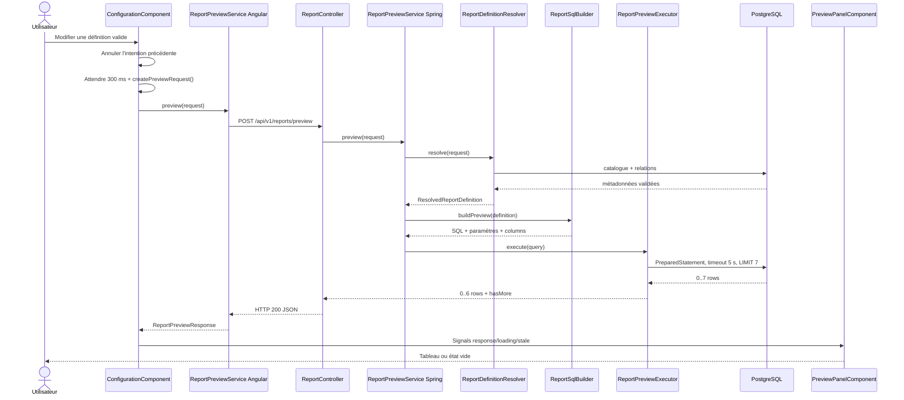

# 03 — Preview synchrone du rapport

## Déclencheur utilisateur

Une modification valide des colonnes, filtres ou tris programme automatiquement une preview dans `ConfigurationComponent`. L'appel part après 300 ms de stabilité. Sans colonne, avec un filtre invalide, pendant le chargement initial ou pendant le démarrage d'une génération, aucun appel ne part. Après une erreur, « Réessayer » relance immédiatement la définition courante si elle reste valide.

## Chaîne complète

```text
Utilisateur modifie une définition valide
  → ConfigurationComponent.schedulePreview()
  → Subject d'intentions + déduplication
  → switchMap (annulation immédiate) + timer(300 ms)
  → createPreviewRequest()
  → ReportPreviewService.preview(request)
  → POST /api/v1/reports/preview
  → JwtCookieFilter / SecurityFilterChain
  → ReportController.preview(@Valid request)
  → ReportPreviewService.preview(request) Spring
  → ReportDefinitionResolver.resolve(request)
  → DataSetRepository + DataSetFieldRepository
  → ResolvedReportDefinition
  → ReportSqlBuilder.buildPreview()
  → PreparedReportQuery(SQL, parameters, columns)
  → ReportPreviewExecutor.execute()
  → JdbcTemplate / PreparedStatement / PostgreSQL
  → jusqu'à 7 ResultSet rows
  → ReportPreviewResponse (jusqu'à 6 rows + hasMore)
  → HTTP 200 JSON
  → Observable<ReportPreviewResponse>
  → Signals previewResult/previewStale/previewLoading
  → PreviewPanelComponent → p-table intégré
  → Utilisateur
```

## Participants du flow

| Participant | Type / responsabilité | Rôle réel |
| --- | --- | --- |
| [`ConfigurationComponent`](../../../Frontend/Rhis_report_gen/src/app/features/rapports/pages/configuration/configuration.component.ts) | Angular Component — UI/orchestration | Construit/déduplique les requêtes, annule les demandes obsolètes et maintient résultat, stale state et erreurs. |
| [`ReportPreviewService` Angular](../../../Frontend/Rhis_report_gen/src/app/features/rapports/services/report-preview.service.ts) | Angular Service — transport | `POST` typé avec `withCredentials`. |
| [`PreviewPanelComponent`](../../../Frontend/Rhis_report_gen/src/app/features/rapports/pages/configuration/components/preview-panel/preview-panel.component.ts) | Angular Component — présentation | Affiche le résultat intégré, les états, le retry et les cellules formatées, sans appel HTTP. |
| `ReportPreviewRequest/Response`, `ApiProblem` TypeScript | Modèles transport | Décrivent JSON et erreurs RFC 9457/`ProblemDetail` utilisées par l'UI. |
| [`JwtCookieFilter`](../../src/main/java/RHIS/com/RHIS/auth/JwtCookieFilter.java) | Spring Security filter — sécurité | Tente d'établir le `SecurityContext` à partir du cookie `accessToken`. |
| [`ReportController`](../../src/main/java/RHIS/com/RHIS/report/controller/ReportController.java) | REST Controller — HTTP/validation | Désérialise, applique `@Valid`, délègue et renvoie `200`. |
| [`ReportPreviewService` Spring](../../src/main/java/RHIS/com/RHIS/report/service/ReportPreviewService.java) | Spring Service — orchestration | Enchaîne resolver, SQL builder et executor, sans logique HTTP. |
| [`ReportDefinitionResolver`](../../src/main/java/RHIS/com/RHIS/report/service/ReportDefinitionResolver.java) | Spring Service — validation/résolution | Produit la définition cataloguée et typée. |
| [`ReportSqlBuilder`](../../src/main/java/RHIS/com/RHIS/report/service/ReportSqlBuilder.java) | Component package-private — construction SQL | Construit SQL PostgreSQL paramétré et métadonnées de colonnes; n'exécute rien. |
| `PreparedReportQuery` | Record interne — handoff | Aligne SQL, paramètres et colonnes de sortie. |
| [`ReportPreviewExecutor`](../../src/main/java/RHIS/com/RHIS/report/service/ReportPreviewExecutor.java) | Component package-private — accès SQL/mapping | Configure timeout, bind les paramètres et mappe le `ResultSet`. |
| `JdbcTemplate`, `PreparedStatement`, PostgreSQL | Infrastructure | Exécutent la requête de données. |
| [`ReportExceptionHandler`](../../src/main/java/RHIS/com/RHIS/report/controller/ReportExceptionHandler.java) | REST advice — erreurs | Convertit les exceptions report en `ProblemDetail` sans exposer le SQL. |

## Étapes détaillées

### 1. Départ et état Angular

Les mutateurs de la définition appellent `schedulePreview()`. Une intention nulle annule l'attente ou la souscription active sans lancer HTTP. Pour une intention valide, le pipeline :

- `previewLoading = true` ;
- efface `previewError` ;
- conserve un résultat précédent et pose `previewStale = true` s'il existe.

Un `switchMap` externe annule immédiatement l'ancienne intention, y compris pendant les 300 ms précédant le prochain appel. Le `switchMap` HTTP interne empêche une réponse annulée de remplacer la définition plus récente. Les définitions consécutives identiques sont ignorées ; retry contourne cette déduplication. La souscription est liée au cycle de vie par `takeUntilDestroyed`; `finalize` remet `previewLoading` à `false` uniquement pour l'intention courante.

### 2. Frontière HTTP et sécurité effective

`ReportPreviewService.preview()` poste vers `${environment.apiBaseUrl}/reports/preview`. En développement, cela correspond à `http://localhost:8080/api/v1/reports/preview`.

Le filtre JWT recherche `accessToken`, charge le user et ses rôles, puis crée une `UsernamePasswordAuthenticationToken` si le JWT est valide. Le `SecurityConfig` courant exige une authentification pour `/api/v1/reports/**`; `ReportControllerSecurityTest.rejectsUnauthenticatedPreview` vérifie le retour `401`. Le service Angular conserve `withCredentials: true`.

### 3. Controller et validation structurelle

Le controller est volontairement mince :

```java
return ResponseEntity.ok(reportPreviewService.preview(request));
```

Spring/Jackson désérialise les enums et records; Jakarta Validation exige une racine, au moins un selected field ID et des objets imbriqués non nuls. Une erreur structurelle ou un enum inconnu devient `400` via `ReportExceptionHandler`.

### 4. Résolution métier

Le resolver suit le pipeline détaillé dans [02 — Définition du rapport](02-report-definition-fields-filters-sorts.md). Les éléments critiques pour la preview sont :

- aucun nom de table/colonne ne vient directement du JSON ;
- chaque field ID est résolu dans `dataset_fields` avec le dataset associé ;
- la racine doit être active et `displayMain=true`; toute cible doit être active, `displayRelated=true` et reliée directement ;
- sélection, filtre et tri passent tous par le même contrôle `field.active && field.visible` ;
- les valeurs texte sont converties en objets Java avant le builder ;
- les joins sont limités à une foreign key sortante directe depuis la racine ;
- un seul chemin direct doit exister par cible.

### 5. Construction SQL

`ReportSqlBuilder.buildPreview()` produit un SQL de cette forme :

```sql
SELECT t0."date_journee" AS "field_10",
       t1."nom" AS "field_20"
FROM "public"."rhis_shift" t0
LEFT JOIN "public"."rhis_employee" t1
  ON t0."employee_fk_id" = t1."emp_pk_id"
WHERE t0."from_planning_manager" = ?
ORDER BY t0."date_journee" ASC
LIMIT 7
```

Construction séquentielle réelle :

```text
selectedFields → SELECT + alias field_{id}
rootDataset → FROM public.{sourceName} t0
ResolvedJoin[] → LEFT JOIN t1, t2... + colonnes composites reliées par AND
ResolvedFilter[] → WHERE prédicats reliés par AND + paramètres
ResolvedSort[] → ORDER BY dans l'ordre demandé
sinon rootPrimaryKeyFields → ORDER BY ... ASC
→ LIMIT 7
```

Les valeurs utilisent uniquement `?`. `CONTAINS` devient `ILIKE ? ESCAPE '!'`; `!`, `%` et `_` sont échappés dans la valeur bindée. Les identifiers catalogués sont entourés de guillemets doubles, avec doublement d'un guillemet interne.

### 6. Exécution et mapping

`ReportPreviewExecutor` prépare le statement, applique `setQueryTimeout(5)`, puis bind les valeurs avec `setObject(index + 1, value)`. Aucun `fetchSize` n'est configuré pour cette requête limitée.

Chaque ligne devient une `LinkedHashMap` pour préserver l'ordre des colonnes. Les dates, heures, date-times, offsets et UUID utilisent `ResultSet.getObject(alias, Type.class)`; les autres types utilisent `getObject(alias)`.

Le builder demande sept lignes. L'executor :

- expose au maximum les six premières ;
- utilise uniquement la septième pour `hasMore = true` ;
- met `returnedRowCount` au nombre réellement exposé ;
- n'exécute aucune requête `COUNT(*)` pour la preview.

## Accès base et cardinalité

```text
ReportDefinitionResolver
  → repositories JPA → datasets/dataset_fields/information_schema
ReportPreviewExecutor
  → JdbcTemplate → SQL dynamique paramétré → tables rhis_* PostgreSQL
```

La racine fournit la cardinalité de départ. Les `LEFT JOIN` visent une clé unique référencée par une foreign key : sous contraintes PostgreSQL normales, chaque ligne racine trouve zéro ou une ligne cible, donc ces joins many-to-one ne multiplient pas les lignes. Si le catalogue de relations ne correspondait plus aux contraintes réelles, le SQL pourrait échouer; le builder ne masque jamais ce problème avec `DISTINCT`.

Il n'y a pas de transaction explicite autour de l'exécution JDBC de preview. Le resolver termine sa transaction read-only avant le builder/executor; la requête de données s'exécute ensuite via la connexion gérée par `JdbcTemplate`. La preview ne garantit donc pas un snapshot transactionnel commun entre lecture des métadonnées et lecture des données métier.

## Transformation des données

```text
Signals Angular
  → ReportPreviewRequest TS
  → JSON
  → ReportPreviewRequest Java (IDs + strings)
  → ResolvedReportDefinition (entities + valeurs typées + joins)
  → PreparedReportQuery (SQL + List<Object> + columns)
  → ResultSet
  → List<LinkedHashMap<String,Object>>
  → ReportPreviewResponse Java
  → JSON
  → ReportPreviewResponse TS
  → previewResult Signal
  → p-table
```

Les clés de row (`field_10`, etc.) sont calculées par le backend et répétées dans `columns[].key`; le template indexe chaque row avec cette clé, sans dépendre du nom SQL physique.

## Chemin retour et erreurs UI

Au succès, `previewResult` est remplacé et `previewStale` repasse à `false`. Le panneau intégré :

- affiche les headers selon `columns` ;
- affiche les rows dans le même ordre ;
- rend `null` par un tiret et les booléens par Oui/Non ;
- affiche un état « Aucune donnée » si la liste est vide.

Après une erreur de rafraîchissement, l'ancien résultat reste affiché et identifié comme ancien. Sans ancien résultat, le panneau montre l'erreur et « Réessayer ». Le panneau est ancré dans le layout à partir de 48rem et partage une instance unique avec l'onglet mobile « Aperçu ». Réduire le panneau ou changer d'onglet ne déclenche aucune requête et ne détruit aucun état.

## Cas d'erreur

| Cause réelle | Exception / statut | Retour UI |
| --- | --- | --- |
| JSON/validation Jakarta invalide | `400`, `ProblemDetail` « Requête de preview invalide » | Message local invitant à vérifier colonnes, filtres et tris |
| Dataset/field devenu inactif, masqué ou non exposé | `ReportDefinitionUnavailableException` → `409` avec `unavailableElements` | Message local invitant à recharger la configuration |
| Définition, type, relation, filtre ou tri invalide | `ReportValidationException` → `400` | Message local de validation |
| Timeout JDBC après 5 s | `ReportQueryTimeoutException` → `504` | Message nettoyé, SQL non exposé |
| Autre `DataAccessException` | `ReportExecutionException` → `500` | Message métier générique |
| Réseau Angular (`status = 0`) | aucun appel backend exploitable | Message de connexion |
| `401` | session absente ou expirée | Message de session expirée ; retry manuel possible après reconnexion |

Le handler est limité aux trois controllers report; il ne couvre pas les controllers auth/dataset.

## Diagramme de séquence



## En langage métier

1. L'utilisateur modifie sa définition ; l'aperçu se programme automatiquement.
2. L'application envoie les IDs de données choisis et les conditions, jamais du SQL.
3. Le backend vérifie le catalogue, les types et les relations.
4. Il construit une requête paramétrée et lit une ligne supplémentaire pour savoir si la liste continue.
5. Au maximum six lignes sont renvoyées et affichées.
6. En cas d'échec de rafraîchissement, le dernier aperçu réussi reste visible.

## Points importants à retenir

- `ReportSqlBuilder` construit; `ReportPreviewExecutor` exécute.
- La limite SQL est 7 mais la limite UI est 6.
- La preview n'utilise pas `COUNT(*)`, contrairement à la génération complète.
- Les values sont paramétrées; seuls des identifiers issus du catalogue entrent dans le SQL.
- Le SQL de données n'est pas exécuté dans la transaction read-only du resolver.

## Points potentiellement confus

- `ReportPreviewService` existe des deux côtés, Angular et Spring.
- `returnedRowCount` est la taille de cette page de preview, pas le total métier.
- `hasMore` ne fournit ni offset ni cursor : aucun endpoint de page suivante n'existe.
- Annuler la souscription Angular neutralise une réponse obsolète côté UI, sans garantir l'arrêt immédiat du traitement PostgreSQL déjà commencé.
