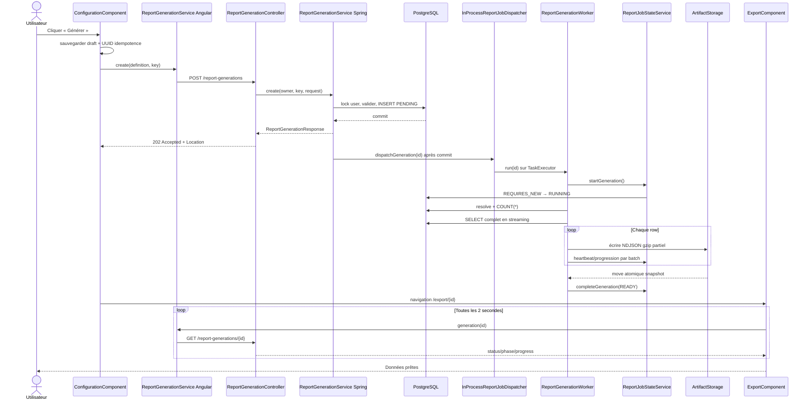

# 04 — Génération complète asynchrone

## Déclencheur utilisateur

L'utilisateur clique sur « Générer ». La méthode `ConfigurationComponent.continueToExport()` sauvegarde d'abord le brouillon local, puis crée une génération serveur.

## Chaîne complète

```text
Utilisateur
  → ConfigurationComponent.continueToExport()
  → ReportDraftStorageService.save(sessionStorage)
  → crypto.randomUUID() comme Idempotency-Key
  → ReportGenerationService Angular.create()
  → POST /api/v1/report-generations
  → ReportGenerationController.create(principal, header, request)
  → ReportGenerationService Spring.create()
  → idempotence + lock user + capacité + ReportDefinitionResolver
  → INSERT report_generation status=PENDING
  → commit
  → ReportJobDispatcher.dispatchGeneration()
  → InProcessReportJobDispatcher / TaskExecutor
  → ReportGenerationWorker.run()
  → ReportJobStateService.startGeneration() REQUIRES_NEW
  → JSON definition → ReportPreviewRequest → resolve()
  → ReportSqlBuilder.buildCount() / ReportFullQueryExecutor.count()
  → ReportSqlBuilder.buildFull() / stream(fetchSize)
  → ReportSnapshotWriter
  → FileSystemReportArtifactStorage.writeAtomically(snapshot.ndjson.gz)
  → ReportJobStateService.completeGeneration() status=READY
  ↔ ExportComponent polling GET /report-generations/{id} toutes les 2 s
  → Signals generation → progress bar / boutons d'export
```

## Participants du flow

| Participant | Type / responsabilité | Rôle réel |
| --- | --- | --- |
| [`ConfigurationComponent`](../../../Frontend/Rhis_report_gen/src/app/features/rapports/pages/configuration/configuration.component.ts) | Angular Component — orchestration | Sauvegarde le draft, crée la génération et navigue vers l'écran export. |
| [`ReportGenerationService` Angular](../../../Frontend/Rhis_report_gen/src/app/features/rapports/services/report-generation.service.ts) | Angular Service — transport | POST avec idempotency header, GET polling et DELETE cleanup. |
| [`ExportComponent`](../../../Frontend/Rhis_report_gen/src/app/features/rapports/pages/export/export.component.ts) | Angular Component — suivi UI | Poll toutes les 2 s, reprend après coupure et présente état/progression. |
| `ReportGeneration` TypeScript | Interface transport | Représente status, phase, compteurs, dates et error code. |
| [`ReportGenerationController`](../../src/main/java/RHIS/com/RHIS/report/controller/ReportGenerationController.java) | REST Controller — HTTP/scope utilisateur | Lit principal + header UUID, retourne `202 Accepted` et `Location`. |
| [`ReportGenerationService` Spring](../../src/main/java/RHIS/com/RHIS/report/service/ReportGenerationService.java) | Spring Service — transaction/orchestration | Gère idempotence, capacité, ownership, persistance et dispatch après commit. |
| [`ReportGenerationEntity`](../../src/main/java/RHIS/com/RHIS/report/entity/ReportGenerationEntity.java) | Entity JPA — état durable | Stocke owner, idempotency key, JSON, status/progress, snapshot et expiration. |
| [`ReportGenerationRepository`](../../src/main/java/RHIS/com/RHIS/report/repository/ReportGenerationRepository.java) | Repository — persistance/locks | Recherche owner-scoped, compte les actifs et persiste les transitions. |
| [`ReportJobDispatcher`](../../src/main/java/RHIS/com/RHIS/report/service/ReportJobDispatcher.java) | Interface — frontière async | Contrat réellement utilisé; une seule implémentation in-process existe. |
| [`InProcessReportJobDispatcher`](../../src/main/java/RHIS/com/RHIS/report/service/InProcessReportJobDispatcher.java) | Component — infrastructure async | Soumet `FutureTask` au pool et permet l'interruption locale. |
| [`ReportGenerationWorker`](../../src/main/java/RHIS/com/RHIS/report/service/ReportGenerationWorker.java) | Component — worker/orchestration | Revalide, compte, stream, écrit le snapshot et publie les états. |
| [`ReportJobStateService`](../../src/main/java/RHIS/com/RHIS/report/service/ReportJobStateService.java) | Spring Service — transactions d'état | Isole chaque transition/heartbeat dans `REQUIRES_NEW`. |
| [`ReportFullQueryExecutor`](../../src/main/java/RHIS/com/RHIS/report/service/ReportFullQueryExecutor.java) | Component — accès SQL streaming | Exécute count puis lecture forward-only avec timeout/fetchSize. |
| [`ReportSnapshotWriter`](../../src/main/java/RHIS/com/RHIS/report/snapshot/ReportSnapshotWriter.java) | Component — sérialisation | Écrit metadata puis rows en NDJSON gzip. |
| [`ReportArtifactStorage`](../../src/main/java/RHIS/com/RHIS/report/storage/ReportArtifactStorage.java) | Interface — abstraction stockage | Utilisée par services/workers; une seule implémentation filesystem existe. |
| [`FileSystemReportArtifactStorage`](../../src/main/java/RHIS/com/RHIS/report/storage/FileSystemReportArtifactStorage.java) | Component — filesystem | Écrit un `.partial`, puis move atomique si supporté. |
| `ReportGenerationStatus`, `ReportGenerationPhase` | Enums d'état | `PENDING/RUNNING/READY/FAILED/EXPIRED` et phases de progression. |

## Création transactionnelle

`POST /api/v1/report-generations` exige le header UUID `Idempotency-Key` et le même body que la preview.

Dans `@Transactional ReportGenerationService.create()` :

1. recherche `(ownerId, idempotencyKey)` sans lock; si trouvé, retourne la génération existante, même si le nouveau body diffère ;
2. lock pessimiste la ligne `users` par `findByIdForUpdate()` pour sérialiser les créations du même user ;
3. revérifie la clé d'idempotence sous lock ;
4. compte les générations `PENDING/RUNNING`; limite par défaut : 2/user ;
5. exécute `definitionResolver.resolve(request)` avant toute création de job ;
6. sérialise le request en JSONB ;
7. insère `report_generation` avec UUID serveur, `PENDING`, progression 0 et expiration +30 min ;
8. `saveAndFlush()` force la contrainte unique `(owner_user_id, idempotency_key)` ;
9. enregistre un callback `afterCommit` pour dispatcher seulement si la transaction réussit.

Une `DataIntegrityViolationException` de course concurrente entraîne une relecture de la génération gagnante. Toute runtime exception non interceptée provoque le rollback Spring de cette transaction.

Le controller retourne `202`, le body `ReportGenerationResponse` et `Location: /api/v1/report-generations/{id}`. Angular navigue immédiatement vers `/rapports/export/{id}`.

## Exécution asynchrone

`ReportJobConfiguration` crée un `ThreadPoolTaskExecutor` in-process : core 2, max 4, queue 25 par défaut. Il n'y a ni broker, ni reprise après redémarrage JVM, ni worker distribué.

`startGeneration()` ouvre une transaction `REQUIRES_NEW`, ne prend le job que s'il est encore `PENDING`, puis le passe à `RUNNING/VALIDATING`. Le worker désérialise `definition_json` et **revalide** le catalogue : la validation de création n'est pas réutilisée en mémoire. Une table ou un champ désactivé entre l'enqueue et l'exécution produit `REPORT_DEFINITION_UNAVAILABLE`; la définition et les artifacts existants ne sont pas supprimés.

### Count

Le worker passe à `COUNTING`, puis exécute :

```sql
SELECT COUNT(*)
FROM root t0
LEFT JOIN ...
WHERE ...
```

Il n'y a ni `SELECT`, ni `ORDER BY`, ni `LIMIT`. Les mêmes joins/filters et paramètres que la requête de données sont reconstruits. Sous les foreign keys many-to-one résolues, le count correspond aux lignes racine filtrées; aucune déduplication artificielle n'est appliquée.

### Lecture complète et snapshot

`buildFull()` construit la même sélection, joins, filters et order que la preview, sans `LIMIT`. `ReportFullQueryExecutor.stream()` :

- prépare un result set forward-only/read-only ;
- applique le timeout configurable (120 s) ;
- désactive temporairement `autoCommit` afin que PostgreSQL honore le `fetchSize` 500 et stream les rows ;
- bind les paramètres ;
- mappe chaque row et vérifie l'interruption du thread ;
- appelle le consumer row par row ;
- fait `connection.rollback()` à la fin, car ce flux est strictement en lecture ;
- restaure l'auto-commit.

`ReportSnapshotWriter` écrit d'abord `ReportSnapshotMetadata(columns, totalRows)`, puis une ligne JSON par row dans `snapshot.ndjson.gz`. Le storage écrit dans un fichier partiel du dossier `{generationId}`, puis le renomme vers la cible. Les mises à jour de progression ont lieu tous les 100 rows ou à la dernière ligne.

Enfin, `completeGeneration()` publie le chemin, les compteurs, progression 100 et status `READY` dans une nouvelle transaction.

## Polling et chemin retour

`ExportComponent.pollGeneration()` utilise :

```text
timer(0, 2000)
  → switchMap(GET generation)
  → retry réseau/5xx après 2 s
  → takeWhile(non terminal, inclusive=true)
```

Chaque réponse remplace le Signal `generation`, donc le template met à jour status, phase, progression et compteurs. À `READY`, les cartes PDF/XLSX apparaissent. À `FAILED`, un bouton revient à la configuration. Si le code vaut `REPORT_DEFINITION_UNAVAILABLE`, la réponse reconstruit `unavailableElements` depuis `definitionJson` et l'écran affiche uniquement les `displayName`. À `EXPIRED` ou `404`, la route de configuration est reconstruite depuis le draft local.

## Transformation des données

```text
ReportPreviewRequest TS
  → sessionStorage draft
  → JSON HTTP + Idempotency-Key
  → ReportPreviewRequest Java
  → definition_json JSONB + ReportGenerationEntity(PENDING)
  → ReportGenerationResponse(202)
  → worker: JSONB → ReportPreviewRequest
  → ResolvedReportDefinition
  → PreparedCountQuery + PreparedReportQuery
  → ResultSet streaming
  → metadata + NDJSON rows + GZIP
  → snapshot filesystem
  → ReportGenerationEntity(READY)
  → polling JSON
  → ReportGeneration Signal
  → progress UI
```

Le snapshot sépare la lecture PostgreSQL de la génération de formats. PDF et XLSX réutilisent exactement les mêmes rows et le même ordre, sans rejouer le SQL.

## Transactions

| Méthode | Transaction | Contenu / rollback |
| --- | --- | --- |
| `ReportGenerationService.create()` | `@Transactional` | Lock user, capacité, validation, insert. Runtime exception → rollback; dispatch seulement après commit. |
| `get()` | `readOnly` | Lecture owner-scoped. |
| `delete()` | `@Transactional` | Annulation locale, suppression fichiers, delete JPA. Erreur filesystem → exception et rollback DB, mais une interruption déjà envoyée n'est pas rollbackable. |
| `ReportDefinitionResolver.resolve()` | `readOnly`, propagation REQUIRED | Transaction propre dans le worker; rejoint la transaction de création lors du POST. |
| Méthodes `ReportJobStateService` | `REQUIRES_NEW` | Chaque heartbeat/transition commit indépendamment du traitement long. |
| `ReportFullQueryExecutor.stream()` | JDBC manuel | Transaction de lecture sur la connexion, terminée par rollback volontaire. |

## Ownership et sécurité

Les lectures, suppressions et exports recherchent systématiquement `(resourceId, ownerId)` et retournent `404` pour un autre owner, ce qui évite de révéler l'existence de la ressource.

Mais cette protection suppose un `UserPrincipal`. Le `SecurityConfig` courant autorise anonymement `/report-generations/**`; le controller appelle `principal.getUser()` sans null check. L'ownership métier est correct pour un principal valide, mais la barrière HTTP est incohérente et doit être comprise comme un défaut actuel, pas comme une garantie.

## Cas d'erreur

- Request/definition invalide : `400/404` synchrone avant création.
- Header idempotence absent ou invalide : erreur de binding MVC (gérée par le mécanisme Spring général, pas explicitement par le report advice).
- Plus de 2 jobs actifs/user : `ReportCapacityException` → `429`.
- Dispatcher saturé : job persisté puis `FAILED` avec `JOB_CAPACITY_EXCEEDED`; le `202` initial a déjà été renvoyé.
- Métadonnée désactivée après création : status `FAILED`, `errorCode = REPORT_DEFINITION_UNAVAILABLE`, détails métier recalculables depuis la définition conservée.
- Erreur count, SQL, timeout, snapshot, JSON ou storage dans le worker : catch global, log serveur, status `FAILED`, `errorCode = GENERATION_FAILED`.
- Annulation : `Future.cancel(true)` n'interrompt que la tâche de cette JVM; le query executor transforme l'interruption en échec avant que la suppression DB n'achève le cleanup.
- Redémarrage JVM : aucun mécanisme de reprise explicite des `PENDING`; les `RUNNING` devenus stale sont marqués `FAILED` par le cleanup programmé.
- Réseau frontend : polling retenté indéfiniment pour status 0 ou 5xx; les 4xx hors 404 terminent par message.

## Cleanup et expiration

Chaque minute, `ReportJobCleanupService.cleanup()` dans une transaction :

- marque les workers dont le heartbeat dépasse 5 min en `FAILED/WORKER_HEARTBEAT_TIMEOUT` et les interrompt localement ;
- supprime les artifacts des générations expirées non `RUNNING`, vide exports/JSON/snapshot et passe à `EXPIRED` ;
- supprime les métadonnées `EXPIRED` après 24 h.

La suppression manuelle depuis Angular (`previous`, `newReport`, ou navigation) appelle `DELETE /report-generations/{id}`, supprime génération, exports en cascade et dossier de fichiers.

## Diagramme de séquence



## En langage métier

1. La configuration est sauvegardée temporairement dans le navigateur.
2. Le serveur crée un job unique pour cet utilisateur et cette clé.
3. Après validation, le traitement continue dans un thread du serveur.
4. Le serveur compte puis lit toutes les lignes sans tout garder en mémoire.
5. Il crée un snapshot compressé réutilisable.
6. L'écran interroge périodiquement le serveur jusqu'à ce que les données soient prêtes.

## Points importants à retenir

- `202` signifie « accepté », pas « terminé ».
- L'idempotence est scopée par owner et clé, mais ne compare pas le body.
- Le dispatch ne part qu'après commit de la ligne `PENDING`.
- Chaque mise à jour d'état utilise `REQUIRES_NEW` pour rester visible pendant le job long.
- Le job est asynchrone mais reste dans le même processus JVM.

## Points potentiellement confus

- Le nom `ReportGenerationService` existe en Angular et Spring.
- La génération revalide la définition deux fois : au POST puis dans le worker.
- Le rollback JDBC final de `stream()` n'indique pas un échec; il clôt une transaction de lecture.
- Le polling frontend s'arrête à `FAILED`, mais n'affiche que `errorCode` via le modèle; les exceptions internes ne sont jamais renvoyées.
