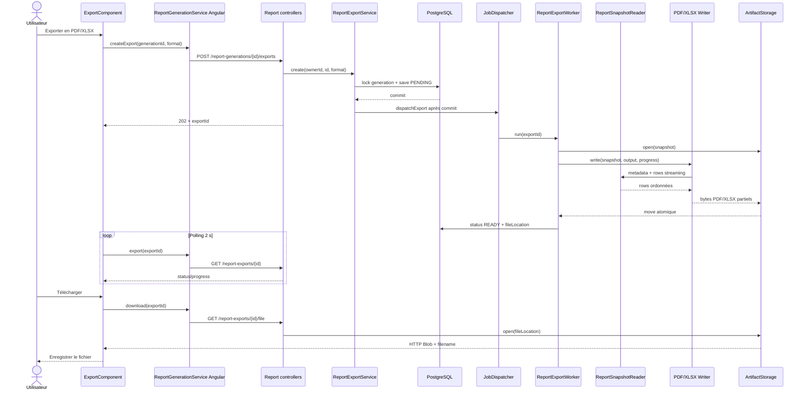

# 05 — Export PDF/XLSX et téléchargement

## Déclencheurs utilisateur

Quand la génération atteint `READY`, l'utilisateur clique sur « Exporter en PDF » ou « Exporter en Excel ». Après traitement, le bouton devient « Télécharger » et déclenche la récupération du fichier.

## Chaîne complète

```text
Utilisateur
  → ExportComponent.createExport(format)
  → ReportGenerationService Angular.createExport()
  → POST /api/v1/report-generations/{generationId}/exports {format}
  → ReportGenerationController.createExport()
  → ReportExportService.create()
  → lock report_generation + INSERT/UPDATE report_export PENDING
  → commit → ReportJobDispatcher.dispatchExport()
  → ReportExportWorker.run()
  → ReportJobStateService.startExport() REQUIRES_NEW
  → ArtifactStorage.open(snapshot.ndjson.gz)
  → ReportExportWriter sélectionné par format
      PDF → ReportSnapshotReader → JasperReports
      XLSX → ReportSnapshotReader → Apache POI SXSSF
  → ArtifactStorage.writeAtomically(report-{exportId}.{ext})
  → ReportJobStateService.completeExport() READY
  ↔ ExportComponent polling GET /api/v1/report-exports/{exportId}
  → clic Télécharger
  → GET /api/v1/report-exports/{exportId}/file
  → InputStreamResource + Content-Disposition
  → HttpResponse<Blob>
  → object URL + ancre download
```

## Participants du flow

| Participant | Type / responsabilité | Rôle réel |
| --- | --- | --- |
| [`ExportComponent`](../../../Frontend/Rhis_report_gen/src/app/features/rapports/pages/export/export.component.ts) | Angular Component — orchestration/UI | Crée/reprend/poll les exports et déclenche le téléchargement navigateur. |
| [`ReportGenerationService` Angular](../../../Frontend/Rhis_report_gen/src/app/features/rapports/services/report-generation.service.ts) | Angular Service — transport | Appelle création, état et fichier binaire. |
| [`ReportDraftStorageService`](../../../Frontend/Rhis_report_gen/src/app/features/rapports/services/report-draft-storage.service.ts) | Angular Service — reprise locale | Associe `generationId + format` à l'`exportId` dans `sessionStorage`. |
| [`ReportGenerationController`](../../src/main/java/RHIS/com/RHIS/report/controller/ReportGenerationController.java) | REST Controller — création | Expose le sous-resource `/generations/{id}/exports`, retourne `202 + Location`. |
| [`ReportExportController`](../../src/main/java/RHIS/com/RHIS/report/controller/ReportExportController.java) | REST Controller — état/fichier | Expose polling et download avec headers de fichier. |
| [`ReportExportService`](../../src/main/java/RHIS/com/RHIS/report/service/ReportExportService.java) | Spring Service — orchestration/transactions | Vérifie owner/status, rend la création par format réutilisable et ouvre le fichier prêt. |
| [`ReportExportEntity`](../../src/main/java/RHIS/com/RHIS/report/entity/ReportExportEntity.java) | Entity JPA — état durable | Stocke format, status, progression, artifact et erreur. |
| [`ReportExportRepository`](../../src/main/java/RHIS/com/RHIS/report/repository/ReportExportRepository.java) | Repository — persistance | Recherche par owner et par couple génération/format. |
| [`ReportExportWorker`](../../src/main/java/RHIS/com/RHIS/report/service/ReportExportWorker.java) | Component — worker/orchestration | Sélectionne le writer, gère artifact atomique, progression et échec. |
| [`ReportExportWriter`](../../src/main/java/RHIS/com/RHIS/report/export/ReportExportWriter.java) | Interface — vraie stratégie de format | Deux implémentations réelles, choisies par `format()`. |
| [`XlsxReportExportWriter`](../../src/main/java/RHIS/com/RHIS/report/export/XlsxReportExportWriter.java) | Component — export XLSX | Stream le snapshot dans un `SXSSFWorkbook` avec cellules typées. |
| [`PdfReportExportWriter`](../../src/main/java/RHIS/com/RHIS/report/export/PdfReportExportWriter.java) | Component — export PDF | Configure/compile/remplit JasperReports et exporte un PDF compressé. |
| [`JasperDynamicTableConfigurer`](../../src/main/java/RHIS/com/RHIS/report/export/JasperDynamicTableConfigurer.java) | Utilitaire package-private — transformation | Remplace dynamiquement header/detail du JRXML selon les columns du snapshot. |
| [`ReportSnapshotReader`](../../src/main/java/RHIS/com/RHIS/report/snapshot/ReportSnapshotReader.java) | Component — lecture streaming | Lit metadata puis rows du NDJSON gzip via cursor forward-only. |
| `ReportArtifactStorage` / `FileSystemReportArtifactStorage` | Interface + infrastructure | Ouvre le snapshot et publie le résultat atomiquement. |
| `ReportExportFormat`, `ReportExportStatus` | Enums métier | `PDF/XLSX` et `PENDING/RUNNING/READY/FAILED`. |

## Création de l'export

Le frontend n'envoie que :

```json
{ "format": "PDF" }
```

`@Valid CreateReportExportRequest` impose un format non nul et Jackson rejette toute valeur hors enum.

`ReportExportService.create()` démarre une transaction et lock pessimiste la génération par `(generationId, ownerId)`. Il exige `generation.status == READY`, relit `definitionJson` et la revalide avant toute création ou réutilisation. La contrainte unique DB `(generation_id, format)` garantit un seul export par format :

- export `READY` existant : il est renvoyé, aucun nouveau job ;
- export `PENDING/RUNNING` : `409 Conflict` ;
- export `FAILED` : la même entity repasse à `PENDING` et est réutilisée ;
- absent : nouvelle entity UUID `PENDING`.

La génération reçoit un nouveau `lastActivityAt`. Le dispatch est enregistré après commit. Le `202` inclut `Location: /api/v1/report-exports/{exportId}`.

## Dispatch et sélection de l'interface

Spring injecte `List<ReportExportWriter>` dans `ReportExportWorker`. Le constructeur crée un `EnumMap<ReportExportFormat, ReportExportWriter>` avec :

```text
PDF  → PdfReportExportWriter
XLSX → XlsxReportExportWriter
```

C'est une abstraction réellement utilisée pour plusieurs implémentations. À l'inverse, `ReportArtifactStorage` n'a qu'une implémentation filesystem actuelle; son interface isole néanmoins tous les services du chemin local concret.

`startExport()` en `REQUIRES_NEW` ne démarre le job que s'il est `PENDING`, si la génération est `READY` et si son snapshot existe logiquement. Il retourne un record `ReportExportWork` contenant aussi `definitionJson`, sans garder l'entity attachée pendant l'export long. Le worker désérialise et résout cette définition immédiatement avant l'écriture.

## Lecture commune du snapshot

`ReportSnapshotReader` ouvre un `GZIPInputStream`, lit la première ligne comme `ReportSnapshotMetadata`, puis avance row par row. Il vérifie l'interruption avant chaque ligne. `SnapshotConsumer.end()` n'est appelé qu'après EOF réussi.

Le snapshot contient des clés techniques `field_{id}` et les metadata contiennent ordre, display name et type. Les writers ne relisent ni catalogue JPA, ni PostgreSQL métier.

## Writer XLSX

`XlsxReportExportWriter` utilise `SXSSFWorkbook` avec une fenêtre configurable de 100 rows et compression des fichiers temporaires :

- crée la sheet `Rapport` ;
- écrit une header row en gras, largeur bornée entre 12 et 40 caractères, freeze pane à la première row ;
- conserve l'ordre des metadata ;
- écrit integer/decimal comme nombre Excel, boolean comme booléen, date/date-time avec styles ;
- convertit `OFFSET_DATE_TIME` vers UTC avant écriture ;
- écrit text/time/UUID comme string et `null` comme cellule vide ;
- accepte aussi plusieurs anciennes représentations temporelles sous forme de listes/epoch ;
- publie une progression de 5 à 95 %, puis 99 après `workbook.write()`.

L'approche SXSSF limite la mémoire pour de grands exports, mais les valeurs numériques passent par `double`, donc une très grande précision `BigDecimal` peut être perdue dans Excel.

## Writer PDF

`PdfReportExportWriter` :

1. crée un dossier de swap Jasper partagé sous le storage root ;
2. ouvre le snapshot, le JRXML de base et le logo ;
3. appelle `JasperDynamicTableConfigurer.configure()` ;
4. crée une colonne Jasper string par colonne snapshot, répartit la largeur disponible et conserve les headers ;
5. compile le design sous un lock JVM global ;
6. remplit le report via `SnapshotDataSource`, qui lit le cursor row par row ;
7. utilise un `JRSwapFileVirtualizer` pour limiter les pages en mémoire ;
8. exporte un PDF compressé ;
9. nettoie toujours le virtualizer.

Toutes les valeurs PDF sont rendues via `toString()`; le PDF ne conserve donc pas les types comme Excel. Le template [`report-export-base.jrxml`](../../src/main/resources/reports/report-export-base.jrxml) fournit page, styles et branding; le tableau est injecté dynamiquement.

## Publication atomique et état

Pour les deux formats, `FileSystemReportArtifactStorage.writeAtomically()` :

- valide que `fileName` ne contient pas de chemin ;
- résout tous les paths sous un root normalisé et rejette le path traversal ;
- écrit dans `{fileName}.*.partial` ;
- renomme vers `report-{exportId}.pdf|xlsx` avec `ATOMIC_MOVE` si disponible, sinon replace move ;
- supprime le partiel en cas d'erreur.

Après succès, `completeExport()` met status `READY`, progression 100, `fileLocation`, efface l'erreur et prolonge l'expiration de la génération.

## Polling, reprise et téléchargement

Angular sauvegarde l'`exportId` par format. Après refresh de page, `resumeExports()` recharge ces IDs et relance le polling, sans recréer l'export.

Le polling a la même stratégie que la génération : toutes les 2 s, retry après réseau/5xx, arrêt inclusif dès que le status n'est plus `PENDING/RUNNING`.

Au clic download :

```text
GET /api/v1/report-exports/{exportId}/file
  → findByIdAndGeneration_Owner_Id
  → exige READY + fileLocation
  → relit et revalide definitionJson
  → storage.open(location)
  → InputStreamResource
  → Content-Type selon format
  → Content-Disposition attachment; filename=rapport-{exportId}.{ext}
  → HttpResponse<Blob>
  → URL.createObjectURL + <a download>
```

L'`InputStream` filesystem reste indépendant de la session JPA après le retour de la méthode transactionnelle. Spring MVC le consomme pour produire la réponse, puis la resource ferme le stream.

## Transformation des données

```text
format TS
  → {format} JSON
  → CreateReportExportRequest
  → ReportExportEntity(PENDING)
  → ReportExportResponse(202)
snapshot.ndjson.gz
  → ReportSnapshotMetadata + Map rows
  → PDF JasperPrint ou XLSX Workbook
  → fichier partiel
  → artifact final
  → ReportExportEntity(READY, fileLocation)
  → polling ReportExportResponse
  → GET file
  → InputStreamResource HTTP
  → Blob Angular
  → fichier téléchargé
```

## Transactions

- `ReportExportService.create()` : transaction read-write avec lock de génération, save export/génération et dispatch après commit. Une exception provoque rollback; aucun worker ne part.
- `get()`, `findReadyForDownload()` et `openDownload()` : transactions read-only et recherches owner-scoped.
- Les transitions `start/update/complete/failExport()` sont chacune `REQUIRES_NEW`; le writer long n'occupe pas une transaction JPA.
- L'écriture filesystem n'est pas transactionnelle avec PostgreSQL. L'atomic move empêche un fichier partiel d'être téléchargé, mais DB et filesystem restent deux ressources distinctes.

## Cas d'erreur

| Cause | Comportement |
| --- | --- |
| Génération absente/autre owner | `404` sans révéler la ressource |
| Génération non `READY` | `409` |
| Export même format déjà actif | `409` |
| Table/champ désactivé à create, worker ou download | `409` synchrone ou `REPORT_DEFINITION_UNAVAILABLE` asynchrone ; snapshot/définition/fichier conservés |
| Format null/inconnu | `400` de validation/désérialisation |
| Writer absent | worker `FAILED`, `EXPORT_FAILED` |
| Snapshot absent/corrompu, Jasper/POI/filesystem en erreur | partiel supprimé, snapshot conservé, export `FAILED` |
| Publication fichier réussie mais completion DB échoue | worker supprime l'artifact publié puis marque `FAILED` |
| Download avant `READY` | `409` |
| File location prête mais fichier illisible/absent | `ReportExecutionException` → `500` |
| Réseau frontend | polling repris pour status 0/5xx; message sinon |

Le worker logue l'exception détaillée côté serveur. Il expose `REPORT_DEFINITION_UNAVAILABLE` pour une indisponibilité métier et `EXPORT_FAILED` pour les autres échecs. Les statuts peuvent inclure `unavailableElements`; l'UI n'affiche que leurs `displayName`.

## Diagramme de séquence



## En langage métier

1. Les données du rapport ont déjà été figées dans un snapshot.
2. L'utilisateur choisit PDF ou Excel.
3. Le serveur transforme le même snapshot dans le format demandé.
4. Le fichier n'est publié qu'une fois entièrement écrit.
5. L'écran suit l'avancement et peut reprendre après un rafraîchissement.
6. Quand le fichier est prêt, le navigateur le télécharge.

## Points importants à retenir

- PDF et XLSX ne rejouent pas la requête SQL.
- Un seul export par `(generation, format)` existe; un échec est relançable sur la même entity.
- `ReportExportWriter` est une interface justifiée par deux implémentations réellement sélectionnées.
- Le storage rend la publication atomique, pas la coordination DB/filesystem.
- Le snapshot reste disponible après un échec d'export pour permettre une nouvelle tentative.

## Points potentiellement confus

- Le endpoint de création d'export appartient à `ReportGenerationController`; état/fichier appartiennent à `ReportExportController`.
- Le nom physique créé par le worker commence par `report-`, mais le nom téléchargé commence par `rapport-`.
- Le PDF transforme toutes les cellules en texte; seul XLSX essaie de conserver les types.
- La reprise frontend repose sur `sessionStorage`; un autre onglet/session ne retrouve pas automatiquement les IDs d'export.
