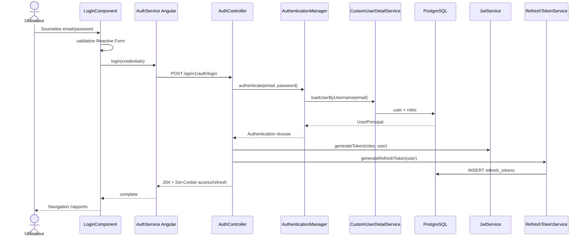
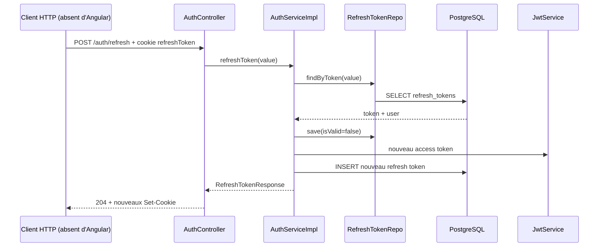

# 06 — Authentification par cookies et refresh token

## Périmètre réel

Le login est complet de l'écran Angular au backend. Le refresh, `/me` et le logout existent au backend, mais Angular n'appelle que `/auth/login`. Il n'y a aucun interceptor, route guard ou mécanisme de refresh automatique dans le frontend courant.

## Flow login — déclencheur et chaîne

L'utilisateur remplit le formulaire et clique sur « Se connecter ».

```text
LoginComponent template (ngSubmit)
  → LoginComponent.submit()
  → typed Reactive Form validation
  → AuthService Angular.login(credentials)
  → POST /api/v1/auth/login withCredentials
  → JwtCookieFilter bypass login
  → AuthController.login(@Valid LoginRequest)
  → AuthService interface / AuthServiceImpl.login()
  → AuthenticationManager.authenticate()
  → UserDetailsService / CustomUserDetailService
  → UserRepository.findByEmailWithRoles()
  → password verification via BCrypt provider
  → JwtService.generateToken(roles claim)
  → RefreshTokenService.generateRefreshToken()
  → INSERT refresh_tokens
  → LoginResponse interne
  → AuthController crée deux Set-Cookie
  → HTTP 204
  → Angular navigate /rapports
```

## Participants du flow

| Participant | Type / responsabilité | Rôle réel |
| --- | --- | --- |
| [`LoginComponent`](../../../Frontend/Rhis_report_gen/src/app/features/auth/pages/login/login.component.ts) | Angular Component — UI/validation | Valide email/password, gère chargement/erreur et navigue au succès. |
| [`AuthService` Angular](../../../Frontend/Rhis_report_gen/src/app/features/auth/services/auth.service.ts) | Angular Service — transport | Poste les credentials avec cookies; aucune autre méthode auth. |
| `LoginCredentials` | Interface TypeScript | Contrat `{email, password}`. |
| [`SecurityConfig`](../../src/main/java/RHIS/com/RHIS/auth/SecurityConfig.java) | Configuration Spring Security | Configure routes, CORS, BCrypt, AuthenticationManager et filtre JWT. |
| [`JwtCookieFilter`](../../src/main/java/RHIS/com/RHIS/auth/JwtCookieFilter.java) | Once-per-request filter — sécurité | Ignore login/refresh; sinon transforme un access cookie valide en authentication. |
| [`AuthController`](../../src/main/java/RHIS/com/RHIS/auth/auth/AuthController.java) | REST Controller — HTTP/cookies | Expose login, refresh, me, logout; les tokens ne sont jamais mis dans le body HTTP. |
| [`AuthService`](../../src/main/java/RHIS/com/RHIS/auth/auth/services/AuthService.java) | Interface Spring — abstraction structurelle | Controller dépend de l'interface; une seule implémentation existe. |
| [`AuthServiceImpl`](../../src/main/java/RHIS/com/RHIS/auth/auth/services/AuthServiceImpl.java) | Spring Service — orchestration auth | Authentifie, construit claims, génère/rotate les tokens et retourne `/me`. |
| `AuthenticationManager` | Spring Security infrastructure | Appelle le provider configuré implicitement avec UserDetailsService + PasswordEncoder. |
| [`CustomUserDetailService`](../../src/main/java/RHIS/com/RHIS/auth/CustomUserDetailService.java) | UserDetailsService — accès identité | Charge user + roles et crée `UserPrincipal`. |
| [`UserPrincipal`](../../src/main/java/RHIS/com/RHIS/auth/UserPrincipal.java) | Security adapter | Expose entity, username, password, enabled et authorities. |
| [`JwtService`](../../src/main/java/RHIS/com/RHIS/auth/JwtService.java) | Service — cryptographie/token | Signe et parse le JWT HMAC, subject email, expiration et claim roles. |
| [`RefreshTokenService`](../../src/main/java/RHIS/com/RHIS/auth/auth/services/RefreshTokenService.java) | Service — création refresh | Génère un UUID opaque et persiste son owner/expiration/validité. |
| `UserRepository`, `RefreshTokenRepo` | Repositories — persistance | Chargent users/roles et persistent/retrouvent refresh tokens. |
| `UserEntity`, `RoleEntity`, `RefreshTokenEntity` | Entities JPA | Tables `users`, `roles`, `user_roles`, `refresh_tokens`. |
| `LoginRequest`, `LoginResponse`, `RefreshTokenResponse`, `Me` | Records DTO | Contrats internes/publics; `LoginResponse`/`RefreshTokenResponse` servent à transporter les tokens service → controller. |
| Exceptions `RefreshToken*`, `InvalidRefreshTokenException`, `UserNotFoundException` | Exceptions métier | Signalent refresh/user invalide, sans handler REST dédié observé. |

## Login détaillé

### 1. Validation frontend

Le `FormBuilder.nonNullable.group` impose email requis + format email et password requis. Un formulaire invalide est marqué touched et aucun HTTP n'est émis. `isLoading` empêche un double submit. En erreur HTTP, l'UI affiche toujours « Vérifiez vos identifiants », sans distinguer réseau, validation ou backend.

`AuthService` importe directement `environment.development`, contrairement aux services report. Son URL est donc explicitement `http://localhost:8080/api/v1/auth/login` dans le code source courant.

### 2. Authentification Spring Security

`/api/v1/auth/**` est `permitAll`, sauf `/auth/me` déclaré plus tôt comme `authenticated`. Le filtre bypass toute URI commençant par `/api/v1/auth/login` et toute URI finissant par `/refresh`.

`AuthController` valide `LoginRequest`, puis `AuthenticationManager` reçoit un `UsernamePasswordAuthenticationToken(email, password)`. La configuration expose un `BCryptPasswordEncoder`; `CustomUserDetailService` charge le user avec un `LEFT JOIN FETCH roles` et le provider vérifie credentials + `isEnabled()`.

### 3. Création des tokens

Après authentification, `createUserRoles()` relit encore le user + roles. Le JWT :

- subject = email ;
- claim `roles` = noms stockés, attendus déjà au format utilisé par les authorities, par exemple `ROLE_ADMIN` ;
- issuedAt = maintenant ;
- expiration = +900000 ms (15 min) ;
- signature HMAC via `spring.application.jwt.secret`.

Le refresh token est un UUID aléatoire opaque, persisté dans `refresh_tokens` avec `is_valid = true` et expiration +518400 s (6 jours).

### 4. Cookies et retour UI

Le controller ignore volontairement le body de `LoginResponse` et renvoie `204 No Content` avec :

```text
accessToken: HttpOnly; Secure; SameSite=None; Path=/; Max-Age=900
refreshToken: HttpOnly; Secure; SameSite=None; Path=/api/v1/auth/refresh; Max-Age=518400
```

JavaScript ne peut pas lire ces cookies. `withCredentials: true` autorise le navigateur à les stocker/envoyer en cross-origin sous réserve de sa politique cookies. Angular reçoit uniquement la complétion de l'`Observable<void>` et navigue vers `/rapports`.

## Flow refresh — backend uniquement

```text
Client externe/interceptor absent
  → POST /api/v1/auth/refresh
  → CookieValue refreshToken
  → AuthServiceImpl.refreshToken(token)
  → RefreshTokenRepo.findByToken()
  → vérifier expiryDate et isValid
  → invalider et save ancien token
  → charger user + roles
  → générer nouveau access JWT
  → générer/persister nouveau refresh UUID
  → RefreshTokenResponse interne
  → Set-Cookie access + refresh
  → HTTP 204
```

L'ancien refresh est marqué invalide avant la création du nouveau. Le nouveau token persisté expire toujours après 6 jours, mais le cookie produit par le endpoint refresh a `Max-Age=604800` (7 jours). Pendant le dernier jour, le navigateur peut donc envoyer un token que la base considère expiré.

## Établissement du principal sur les requêtes suivantes

Pour une URI non bypassée, `JwtCookieFilter` :

1. cherche le cookie `accessToken` ;
2. parse le JWT pour extraire subject et roles ;
3. recharge le user depuis la base ;
4. vérifie subject et expiration ;
5. construit les authorities à partir du claim du JWT ;
6. place une authentication dans `SecurityContextHolder`.

`@AuthenticationPrincipal UserPrincipal` reçoit alors le principal dans les controllers de génération/export. Les rôles du principal chargé ne sont pas ceux utilisés pour les authorities de la requête : le filtre reconstruit les authorities depuis le claim JWT. Une modification de rôle en base n'est donc appliquée aux autorisations qu'après émission d'un nouveau JWT, même si le user est relu.

## `/me` et logout

- `GET /api/v1/auth/me` est `authenticated`, reçoit le `UserPrincipal` et retourne email + rôles de l'entity rechargée. Aucun appel Angular n'existe.
- `POST /api/v1/auth/logout` renvoie deux cookies vides `Max-Age=0`. Il ne recherche ni n'invalide le refresh token en base. Un refresh token copié avant logout reste donc valide côté serveur jusqu'à expiration/rotation.

## Transactions et accès base

Aucune méthode de `AuthServiceImpl` ou `RefreshTokenService` n'est annotée `@Transactional`. Chaque appel Spring Data `save`/lecture utilise sa propre transaction repository. Conséquences :

- le login peut créer un refresh même si une étape HTTP ultérieure échoue, car le cookie n'est pas transactionnel avec la DB ;
- le refresh « invalider ancien → créer nouveau » n'est pas atomique ;
- deux refresh concurrents peuvent lire `isValid = true` avant les saves et tous deux émettre un nouveau token, faute de lock/transaction unique ;
- une erreur après invalidation mais avant création du nouveau token peut laisser le client sans refresh valide.

Cardinalité : un user par email attendu par le code (mais aucune `@Column(unique=true)` visible sur `UserEntity.email`), plusieurs refresh tokens par user, un token UUID unique.

## Cas d'erreur

| Cause | Comportement observé/déductible du code |
| --- | --- |
| Formulaire Angular invalide | Aucun HTTP, messages de champ |
| Mauvais credentials/user disabled | `AuthenticationManager` échoue; UI affiche message générique |
| LoginRequest invalide | validation MVC; aucun advice auth dédié |
| Refresh cookie absent | binding `@CookieValue` échoue avant service |
| Token absent en base | `RefreshTokenNotFoundException` |
| Token expiré | ancien token marqué invalide puis `RefreshTokenExpiredException` |
| Token déjà invalidé | `InvalidRefreshTokenException` |
| JWT access malformé/expiré | le filtre ne catch pas les exceptions de parsing; le comportement HTTP dépend de la chaîne Spring générale |
| User supprimé entre token et requête | `UsernameNotFoundException` depuis le filtre |

Aucun `@RestControllerAdvice` global ne mappe les exceptions auth listées. Il ne faut donc pas supposer un contrat `ProblemDetail` stable pour ces erreurs.

## Risques de sécurité importants

- CSRF est désactivé alors que l'authentification repose sur des cookies `SameSite=None`; les endpoints mutatifs méritent une protection explicite.
- Le secret JWT et les credentials PostgreSQL sont en clair dans `application.yaml` courant.
- Les routes dataset/report sont actuellement `permitAll`; cela contredit l'ownership des controllers async et les tests.
- `secure(true)` signifie que les cookies ne sont normalement envoyés que sur HTTPS; un frontend/backend locaux en HTTP peut rendre le login inutilisable selon le navigateur.
- Le logout ne révoque pas le refresh token serveur.
- Le refresh n'est pas atomique et peut être rejoué concurremment.

## Diagramme de séquence — login



## Diagramme de séquence — refresh



## En langage métier

1. L'utilisateur fournit ses identifiants.
2. Le serveur vérifie le mot de passe et crée deux preuves de session.
3. Le navigateur stocke ces preuves dans des cookies non lisibles par JavaScript.
4. Le petit token expire vite; le refresh token peut en obtenir un nouveau et est alors remplacé.
5. Le code Angular actuel ne déclenche jamais ce remplacement automatiquement.

## Points importants à retenir

- Les tokens ne sont pas renvoyés dans le body; `LoginResponse` est interne au backend.
- Le JWT est stateless, le refresh token est stateful en base.
- `JwtCookieFilter` crée le principal consommé par les controllers owner-scoped.
- Le refresh est une rotation logique, mais pas transactionnellement atomique.
- Le flow frontend se limite au login.

## Points potentiellement confus

- `AuthService` existe côté Angular comme classe et côté Spring comme interface + implémentation.
- La durée du cookie refresh après rotation (7 jours) diffère de la durée DB (6 jours).
- Les authorities viennent du JWT, alors que `/me` lit les rôles de l'entity.
- `permitAll` n'empêche pas le filtre JWT de s'exécuter; il signifie seulement qu'une authentication réussie n'est pas requise pour autoriser la route.

