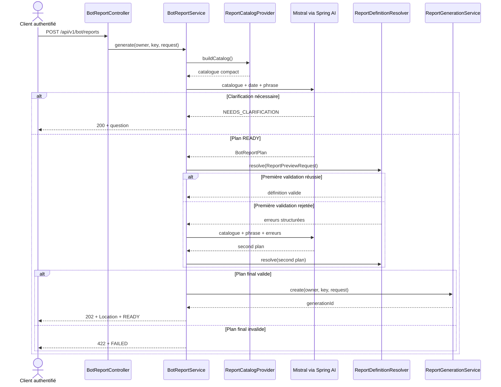

# 07 — Rapport à partir d'une phrase naturelle

## Déclencheur utilisateur

Un client authentifié envoie une phrase française à `POST /api/v1/bot/reports`.
Le backend traduit cette phrase en définition de rapport, la valide avec les mêmes
garde-fous que la preview, puis réutilise la génération asynchrone existante.

## Chaîne complète

```text
POST /api/v1/bot/reports {message, format?}
  → SecurityConfig : /api/v1/bot/** authenticated()
  → BotReportController : principal + Idempotency-Key optionnel
  → BotReportService.generate()
  → ReportCatalogProvider.buildCatalog()
  → JSON : datasets principaux actifs + champs visibles supportés
  → BotReportPlanner.plan() : phrase + catalogue + date du jour
      ├─ NEEDS_CLARIFICATION → 200, aucune génération
      └─ READY
          → BotReportPlan → ReportPreviewRequest
          → ReportDefinitionResolver.resolve()
              ├─ valide → ReportGenerationService.create() → 202 + generationId
              └─ invalide/indisponible
                  → second et dernier appel LLM avec les erreurs
                      ├─ valide → create() → 202
                      ├─ clarification → 200
                      └─ encore invalide → 422 FAILED
  → endpoints existants de polling, export et téléchargement
```

## Participants du flow

| Participant | Responsabilité |
| --- | --- |
| `BotReportController` | Contrat HTTP, principal, idempotence et mapping `200/202/422`. |
| `BotReportService` | Orchestration, mapping du plan, validation et auto-correction unique. |
| `ReportCatalogProvider` | Catalogue compact issu des métadonnées actives et visibles. |
| `BotReportPlanner` | Appel Spring AI/Mistral avec structured output et timeout. |
| `ReportDefinitionResolver` | Validation autoritative des IDs, types, opérateurs, valeurs, joins et tris. |
| `ReportGenerationService` | Création owner-scoped du job asynchrone existant. |
| `BotExceptionHandler` | `400` pour une requête bot invalide et `502` pour un échec LLM. |

## Contrat HTTP

Requête :

```json
{
  "message": "Liste des employés avec leur date d'embauche, triée par nom",
  "format": "XLSX"
}
```

- `message` est obligatoire, non blanc et limité par `rhis.bot.max-message-length`
  (2000 par défaut).
- `format` accepte `PDF` ou `XLSX`. S'il est absent, le backend choisit `XLSX`.
- Le format n'est actuellement pas déduit du texte de `message`.
- `Idempotency-Key` est un UUID optionnel ; le controller en génère un s'il manque.

| Résultat | HTTP | Effet |
| --- | --- | --- |
| Plan validé et génération créée | `202` + `Location` | `READY`, `generationId`, `format`, résumé. |
| Phrase ambiguë | `200` | `NEEDS_CLARIFICATION`, question courte, aucun job. |
| Deuxième plan encore invalide | `422` | `FAILED`, liste d'erreurs, aucun nouveau job. |
| Body vide/invalide ou message trop long | `400` | Validation MVC ou `ProblemDetail`. |
| Appel Mistral en échec/timeout | `502` | `ProblemDetail`, aucun job. |
| Requête anonyme | `401` | Bloquée avant le controller. |

## Données envoyées au LLM

Le premier appel contient :

- le system prompt avec les règles d'IDs, d'opérateurs, de valeurs et de tri ;
- la date locale du serveur (`LocalDate.now()`) ;
- le catalogue JSON : `datasetId`, `displayName`, puis pour chaque champ
  `fieldId`, `displayName`, `type` et `operators` ;
- la phrase utilisateur.

Si la validation backend rejette le premier plan, le second appel reçoit en plus les
erreurs de validation. Il n'existe pas de troisième appel. Aucune ligne métier, aucun
résultat de rapport et aucun SQL ne sont envoyés au modèle. Le SQL reste construit par
le pipeline report existant.

## Validation et génération

Le structured output ne constitue pas une frontière de confiance. Le service convertit
les noms d'enum avec `FilterOperator.valueOf()` et `SortDirection.valueOf()`, puis appelle
`ReportDefinitionResolver.resolve()` avant toute génération. Le resolver vérifie le
catalogue courant ; un ID inventé, un champ masqué, un opérateur incompatible, une mauvaise
arité ou un tri invalide est rejeté.

Après validation, `ReportGenerationService.create()` conserve ses règles existantes :
ownership, idempotence, capacité par utilisateur, persistance `PENDING` et dispatch après
commit. Le client continue ensuite avec :

1. `GET /api/v1/report-generations/{generationId}` ;
2. `POST /api/v1/report-generations/{generationId}/exports` ;
3. `GET /api/v1/report-exports/{exportId}` ;
4. `GET /api/v1/report-exports/{exportId}/file`.

## Diagramme de séquence



## En langage métier

1. Le serveur présente au modèle uniquement les rapports et colonnes autorisés.
2. Le modèle propose une définition structurée ou pose une question de clarification.
3. Le backend ne fait jamais confiance directement à cette proposition : il la revalide.
4. Une proposition invalide peut être corrigée une seule fois.
5. Une proposition valide démarre le même traitement asynchrone que l'écran de rapport.

## Points importants à retenir

- `/api/v1/bot/**` exige une authentification backend explicite.
- Deux appels LLM au maximum sont effectués par requête.
- Le modèle ne produit ni SQL ni données métier.
- `202 READY` signifie que la génération est créée, pas que le fichier est déjà prêt.
- La clé Mistral vient uniquement de `MISTRAL_API_KEY` au runtime.

## Points potentiellement confus

- `READY` dans `BotReportResponse` signifie « plan validé et job créé » ; le job reste
  initialement `PENDING` dans le pipeline de génération.
- Le résumé du modèle est informatif et n'est pas utilisé pour construire le SQL.
- Une clarification retourne `200`, tandis qu'un plan rejeté après correction retourne `422`.
- Une phrase mentionnant PDF ne change pas le format si le champ JSON `format` est absent ;
  la valeur par défaut reste `XLSX`.
